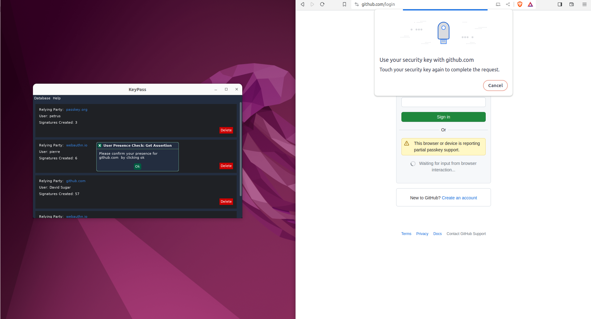
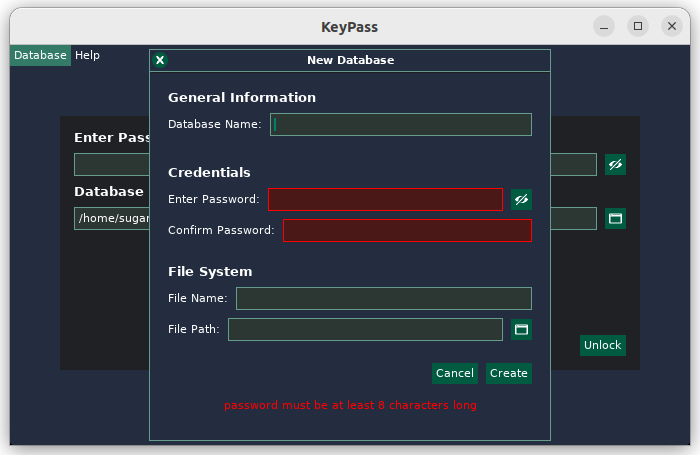
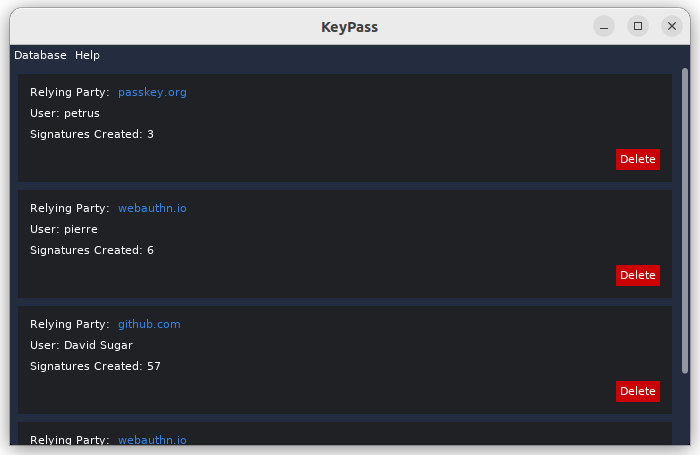
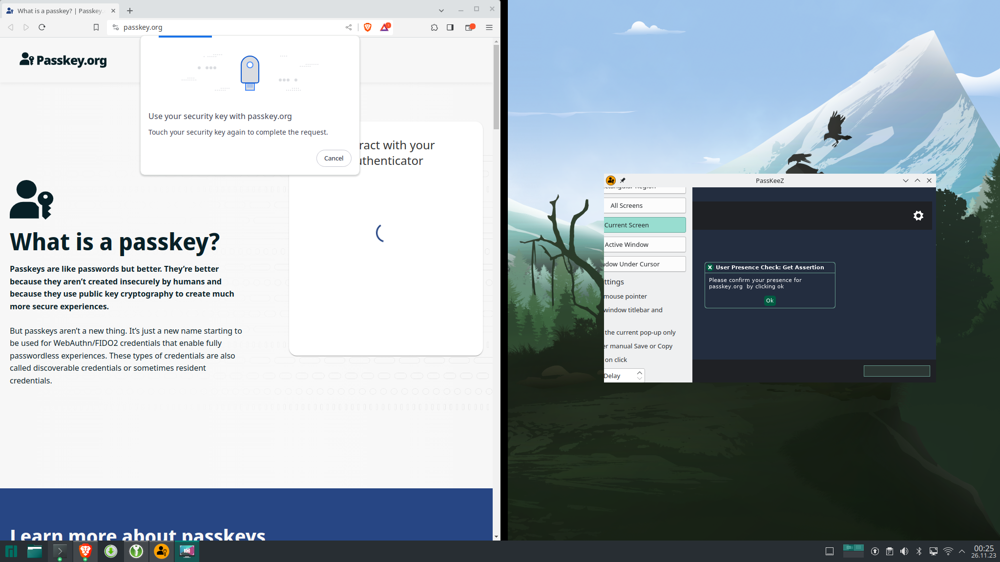

# PassKeeZ

PassKeeZ is a Passkey (FIDO2) compatible authenticator for Linux based on [keylib](https://github.com/r4gus/keylib).

If you want to know more about how PassKeeZ is used, please visit the [First Steps](https://github.com/Zig-Sec/PassKeeZ/wiki/First-Steps) section of the wiki.

The project currently supports only Linux due to the absence of a standardized API for interprocess communication (IPC) between the client and authenticator. As a workaround, platform authenticators on Linux act as virtual USB HID devices utilizing uhid. However, extending this functionality to other platforms remains unexplored as I haven't had the opportunity to investigate the equivalent mechanisms elsewhere.

| Browser | Supported? | Tested version| Notes |
|:-------:|:----------:|:-------------:|:-----:|
| Cromium   | &#9989;    | 119.0.6045.159 (Official Build) Arch Linux (64-bit) | |
| Brave | &#9989; | Version 1.62.153 Chromium: 121.0.6167.85 (Official Build) (64-bit) | |
| Firefox | &#9989; | 122.0 (64-bit) |  |
| Opera | &#9989; | version: 105.0.4970.16 chromium: 119.0.6045.159 | |

> [!NOTE]
> All tests were conducted using passkey for Github.

> [!IMPORTANT]
> Browsers running in sandboxed environments might not be able to communicate with the authenticator out of the box (e.g. when installing browsers with the Ubuntu App Center).

## Features

* Works with all services that support Passkeys.
* Store your Passkeys (just a private key + related data) in a local, encrypted database. Choose either the KDBX (KeePassXC, ...) or CCDB database format.
* Constant sign-counter, i.e. you can safely sync your credentials/passkeys between devices.

> [!IMPORTANT]
> KDBX support has been added with version 0.5.0. The advantage of using KDBX is that you can manage your passkeys using KeePass or KeePassXC (PassKeeZ uses the same format for storing passkeys as KeePassXC). If you run into issues please open an issue.

## Install

Currently, PassKeeZ is only availbale for Linux.

### Linux

#### Manual Installation

1. Download the pre-built binaries for `passkeez` and `zigenity` and move them to `/usr/local/bin` (you need to rename them).
2. Create the following directory if it does not already exist `~/.local/share/systemd/user` and add the [passkeez.service](https://github.com/Zig-Sec/PassKeeZ/blob/master/script/passkeez.service) file. With this change you can run the following commands:
    - `systemctl --user enable passkeez.service`: enable PassKeeZ to start automatically
    - `systemctl --user disable passkeez.service`: disable PassKeeZ to start automatically
    - `systemctl --user start passkeez.service`: start PassKeeZ in the background
    - `systemctl --user stop passkeez.service`: stop PassKeeZ
    - `systemctl --user status passkeez.service`: get the status of the PassKeeZ process
3. Add yourself to the `fido` group and enable the `uhid` module:
```bash
# Create a new group called fido
getent group fido || (groupadd fido && usermod -a -G fido $SUDO_USER)

# Add uhid to the list of modules to load during boot
echo "uhid" > /etc/modules-load.d/fido.conf

# Create a udev rule that allows all users that belong to the group fido to access /dev/uhid
echo 'KERNEL=="uhid", GROUP="fido", MODE="0660"' > /etc/udev/rules.d/90-uinput.rules
udevadm control --reload-rules && udevadm trigger
```
4. Create the `~/.passkeez` folder if it does not exist and add a `config.json` file with the following content: `{"db_path":"~/.passkeez/passkeez.kdbx", "lang":"english"}`.
    - PassKeeZ supports the KDBX (KeePassXC, KeePass, ...) version 4 and Cbor Credential Database format. To use KDBX specify a path to a file with the ending `.kdbx` and for CCDB to a file with the ending `.ccdb`. __It is not required that the file exists! In that case, a new database will be created the next time PassKeeZ wants to access the database.__
    - PassKeeZ currently supports `english` and `german`.

#### Script

Run the following script to install PassKeeZ automatically:

```bash
sudo bash -c "$(curl -fsSL https://github.com/Zig-Sec/PassKeeZ/releases/download/0.5.0/install-linux.sh)"
```

### Database Management

- KDBX: You can manage your `.kdbx` database with [KeePassXC](https://keepassxc.org/).
- CCDB: Currently the only way to manage your Credentials is by using the [CCDB command line application](https://github.com/r4gus/ccdb).

### File synchronization

You can synchronize your database files using a service like [Syncthing](https://docs.syncthing.net/intro/getting-started.html) between your devices. This allows you to use the same Passkeys to login to your accounts on multiple devices.

#### Syncthing

Please see the [Getting Started guide](https://docs.syncthing.net/intro/getting-started.html) on how to setup Syncthing on your device. Make sure you also setup Syncthing to [startup automatically](https://docs.syncthing.net/users/autostart.html#linux), to prevent a situation where your databases are out of sync.

## Contributing

Currently this application and the surrounding infrastructure is only maintained by me. One exception is the graphics library [dvui](https://github.com/david-vanderson/dvui) I use for the frontend (zigenity).

If you find a bug or want to help out, feel free to either open a issue for one of the mentioned projects or write me a mail.

All contributions are welcome! Including:

* Bug fixes
* Documentation
* New features
* Support for other systems (linux distros, OSs, ...)
* ...

## QA

<details>
<summary><ins>What is this project about?</ins></summary>

FIDO2 stands as a dedicated authentication protocol crafted for diverse authentication needs. Whether employed as a standalone method, supplanting traditional password-based authentication, or as an additional layer of security, FIDO2 serves both purposes. The FIDO Alliance has actively advocated for the widespread adoption of this protocol for several years, with 2023 witnessing a substantial surge in its adoption. However, it's crucial to note that FIDO2 introduces a heightened level of complexity in comparison to conventional passwords. Notably, the use of roaming authenticators, such as YubiKey, can be a cost-intensive aspect.

Upon initiating the keylib project in October 2022, my primary objective was to develop a library empowering individuals to transform their own hardware, such as ESP32, into a functional authenticator. I believe I've achieved this goal successfully. However, during this process, I also recognized the evolving trend favoring hybrid/platform authenticators with discoverable credentials, now commonly marketed as Passkeys.

While traditional authenticators like YubiKeys provide robust protection against various attacks, they come with notable drawbacks. Their high cost, limited update/patching capabilities, and restricted storage for discoverable credentials (for instance, my YubiKey 5 supports around 25 credentials) underscore these challenges. Additionally, the inability to back up data, although enhancing confidentiality, poses availability concerns. The official solution offered for this predicament is surprisingly simple: "buy a second one."

Conversely, platform authenticators present a more flexible and cost-effective alternative. Unlike traditional counterparts, they can undergo regular updates and patches, akin to any software component. Furthermore, these authenticators permit the backup and secure sharing of credentials, leveraging an encrypted database within this project.

One key advantage lies in their cost-effectiveness, eliminating the need for additional hardware. When implemented with precision, platform authenticators can attain a commendable level of security, providing a compelling alternative to their more expensive counterparts.

The primary objective of this project is to furnish an alternative —keeping in mind that the term "alternative" is subjective and, due to resource constraints, I may not offer a polished, "commercial-grade" product— to existing commercial Passkey implementations.

</details>

<details>
<summary><ins>What is FIDO2/ Passkey?</ins></summary>
Please read the QA of the [keylib](https://github.com/r4gus/keylib) project.
</details>

<!--
## Showcase

<table>
  <tr>
    <td></td>
    <td></td>
  </tr>
  <tr>
    <td></td>
    <td></td>
  </tr>
</table>
-->
