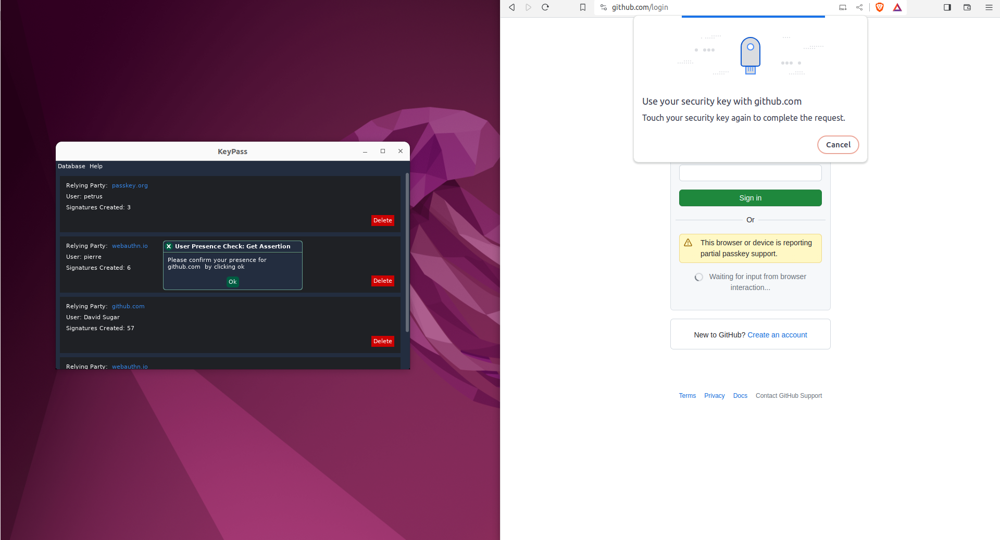
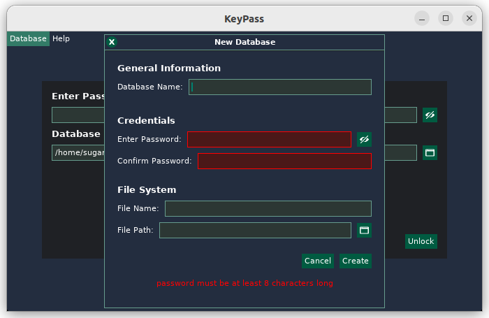
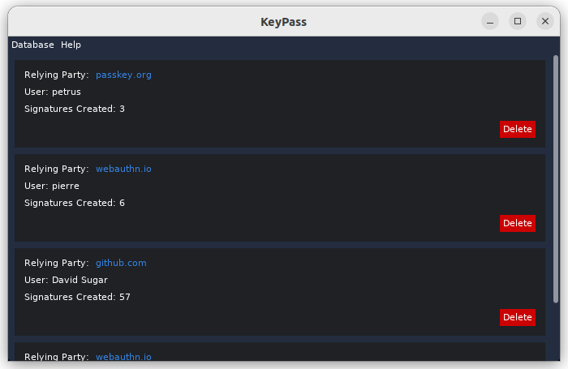
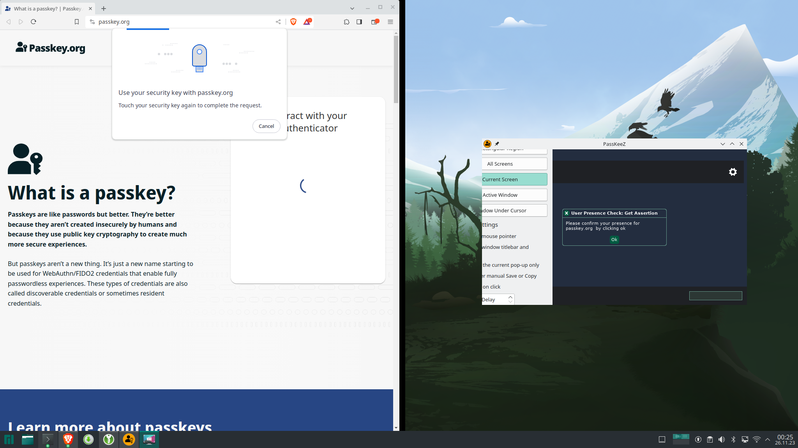

<a href="https://liberapay.com/r4gus/donate"></a>

PassKeeZ is a Passkey (FIDO2) compatible authenticator for Linux based on [keylib](https://codeberg.org/r4gus/keylib).

Since version `0.7.4` PassKeeZ is fully compatible with [KeePassDX](https://www.keepassdx.com) for android, i.e., by synchronizing your KDBX-database between your Linux machine and your Android device (e.g., by using [Syncthing](https://syncthing.net)), passkeys created with PassKeeZ are also available with KeePassDX and vice versa. For more info read the [wiki](https://codeberg.org/r4gus/PassKeeZ/wiki/Cross-platform+passkey+usage.-).

> [!IMPORTANT]
> If you like this project, you can contribute in many forms, e.g., if you know how to package software for different distros you can help with making the installation process better.

## Installing PassKeez

### via Package Manager

#### Arch

The [Arch User Repository (AUR)](https://aur.archlinux.org/packages/passkeez) offers a package maintained by the community.

#### Debian/ Ubuntu

Follow these steps to install PassKeeZ using `apt`.

##### Import the public key

From a terminal, install `gnupg` and `curl` if they are not already available:

```bash
sudo apt install gnupg curl
```

To import the PassKeeZ public GPG-key, run the following command:

```bash
curl -fsSL https://pgp.passkeez.org/passkeez.asc | sudo gpg -o /usr/share/keyrings/passkeez.gpg --dearmor
```

##### Import the list file

Create the list file `/etc/apt/sources.list.d/passkeez.list`:

```bash
echo "deb [ arch=amd64 signed-by=/usr/share/keyrings/passkeez.gpg ] https://ppa.passkeez.org/ stable main" | sudo tee /etc/apt/sources.list.d/passkeez.list
```

##### Reload package database and install PassKeeZ

First update the package database with:
```
sudo apt update
```

Next, install the latest stable version of PassKeeZ:
```
sudo apt install passkeez
```

### Install Script

> For "lazy" people. If in doubt please read the script before running it.

| Version | Command |
|:--------|:--------|
| 0.6.3   | `sudo bash -c "$(curl -fsSL https://codeberg.org/r4gus/PassKeeZ/raw/branch/master/script/install-linux.sh)" install-linux.sh --vpasskeez 0.6.3 --vzig 0.15.2 --vzigenity 0.7.1`|
| 0.7.4   | `sudo bash -c "$(curl -fsSL https://codeberg.org/r4gus/PassKeeZ/raw/branch/master/script/install-linux.sh)"` |

You can find more info in the [Wiki](https://codeberg.org/r4gus/PassKeeZ/wiki).

**Browsers**

| Browser | Supported? | Tested version| Notes |
|:-------:|:----------:|:-------------:|:-----:|
| Cromium   | &#9989;    | 119.0.6045.159 (Official Build) Arch Linux (64-bit) | |
| Brave | &#9989; | Version 1.62.153 Chromium: 121.0.6167.85 (Official Build) (64-bit) | |
| Firefox | &#9989; | 122.0 (64-bit) |  |
| Opera | &#9989; | version: 105.0.4970.16 chromium: 119.0.6045.159 | |

> [!IMPORTANT]
> Browsers running in sandboxed environments might not be able to communicate with the authenticator out of the box (e.g. when installing browsers with the Ubuntu App Center).

## Features

* Works with all services that support Passkeys.
* Store your Passkeys (just a private key + related data) in a local, encrypted database.
* Compatible with other KeePass applications, including [KeePassXC](https://keepassxc.org) and [KeePassDX](https://www.keepassdx.com)
* Constant sign-counter, i.e. you can safely sync your credentials/passkeys between devices.

> [!IMPORTANT]
> With the release of version 0.5.0, PassKeeZ uses the KDBX format for storing credentials. The advantage of using KDBX is that you can manage your passkeys using KeePass or KeePassXC (PassKeeZ uses the same format for storing passkeys as KeePassXC). If you run into issues please open an issue.
>
> Applications like password managers (a FIDO2 authenticator is just a fancy password manager that implements the CTAP2 spec) have to make a trade-off between confidentiality and availability. By supporting KDBX4, PassKeeZ is in a sweet-spot between those two aspects (this is of course my opinion). Users stay in full control over their credentials and can use existing applications like KeePass(XC) to manage credentials. Furthermore, we abstract away from the OS, i.e., even if someone has access to the device and can unlock it, the data stored within KDBX is still confidential (unless you use the same password for both your KDBX4 file and the user account). This is also the reason why PassKeeZ won't support biometrics. As biometrics are not suitable for deriving deterministic values (keys, seeds, etc.) one has to store the actual secret for "unlocking" the KDBX file somewhere indefinitely. This adds just unnecessary complexity.


## Getting Started 

To get started please visit the [wiki](https://codeberg.org/r4gus/PassKeeZ/wiki/Installing-PassKeeZ).  

### Database Management

- KDBX: You can manage your `.kdbx` database with [KeePassXC](https://keepassxc.org/) or KeePass.
    - _We recommend making regular backups of your KDBX database._

### Configuring PassKeeZ

PassKeeZ can be configured via `~/.passkeez/config.json` using the following options:

- `"db_path"`: path to the .kdbx database. If the file doesn't exist, a new file will be created.
- `"lang"`: the language of the application (currently supports `"english"` and `"german"`).
- `"mlock"` (default: `false`): lock the memory using mlock. This will most likely require raising the limits in `/etc/security/limits.conf` to something like:
```
hard    memlock          65536
soft    memlock          65536
```
- `"tout_up"` (default: `10` seconds): grace window in which a new User Presence (UP) request is auto-accepted without re-prompting.
- `"tout_db"` (default: `60` seconds): after this idle period the database is fully deinitialized.

### File synchronization

You can synchronize your database files using a service like [Syncthing](https://docs.syncthing.net/intro/getting-started.html) between your devices. This allows you to use the same Passkeys to login to your accounts on multiple devices.

#### Syncthing

Please see the [Getting Started guide](https://docs.syncthing.net/intro/getting-started.html) on how to setup Syncthing on your device. Make sure you also setup Syncthing to [startup automatically](https://docs.syncthing.net/users/autostart.html#linux), to prevent a situation where your databases are out of sync.

## Contributing

Currently this application and the surrounding infrastructure is only maintained by me. One exception is the graphics library [dvui](https://github.com/david-vanderson/dvui) I use for the frontend (zigenity).

If you find a bug or want to help out, feel free to either open a issue for one of the mentioned projects or write me a mail.

All contributions are welcome! Including:

* Bug fixes
* Documentation
* New features
* Support for other systems (linux distros, OSs, ...)
* ...

## QA

<details>
<summary><ins>Should I use PassKeeZ?</ins></summary>

This is totally up to you and probably depends on what you want to achieve.

If you're primarily interested in secure passkey-based authentication on the web and want to stay in control over your credentials, you could consider using PassKeeZ. PassKeeZ offers from my point of view a better user experience compared to KeePassXC, as one doesn't have to install additional browser plugins, while being compatible with all KeePass password managers, i.e., you can use PassKeeZ for passkey-based authentication and keep managing your credentials with your most favourite KDBX capable password manager (e.g., KeePass, KeePassXC, ...).

</details>

<details>
<summary><ins>What is this project about?</ins></summary>

FIDO2 stands as a dedicated authentication protocol crafted for diverse authentication needs. Whether employed as a standalone method, supplanting traditional password-based authentication, or as an additional layer of security, FIDO2 serves both purposes. The FIDO Alliance has actively advocated for the widespread adoption of this protocol for several years, with 2023 witnessing a substantial surge in its adoption. However, it's crucial to note that FIDO2 introduces a heightened level of complexity in comparison to conventional passwords. Notably, the use of roaming authenticators, such as YubiKey, can be a cost-intensive aspect.

Upon initiating the keylib project in October 2022, my primary objective was to develop a library empowering individuals to transform their own hardware, such as ESP32, into a functional authenticator. I believe I've achieved this goal successfully. However, during this process, I also recognized the evolving trend favoring hybrid/platform authenticators with discoverable credentials, now commonly marketed as Passkeys.

While traditional authenticators like YubiKeys provide robust protection against various attacks, they come with notable drawbacks. Their high cost, limited update/patching capabilities, and restricted storage for discoverable credentials (for instance, my YubiKey 5 supports around 25 credentials) underscore these challenges. Additionally, the inability to back up data, although enhancing confidentiality, poses availability concerns. The official solution offered for this predicament is surprisingly simple: "buy a second one."

Conversely, platform authenticators present a more flexible and cost-effective alternative. Unlike traditional counterparts, they can undergo regular updates and patches, akin to any software component. Furthermore, these authenticators permit the backup and secure sharing of credentials, leveraging an encrypted database within this project.

One key advantage lies in their cost-effectiveness, eliminating the need for additional hardware. When implemented with precision, platform authenticators can attain a commendable level of security, providing a compelling alternative to their more expensive counterparts.

The primary objective of this project is to furnish an alternative, keeping in mind that the term "alternative" is subjective, to existing commercial Passkey implementations.

</details>

<details>
<summary><ins>What is FIDO2/ Passkey?</ins></summary>
Please read the QA of the [keylib](https://codeberg.org/r4gus/keylib) project.
</details>

<!--
## Showcase

<table>
  <tr>
    <td></td>
    <td></td>
  </tr>
  <tr>
    <td></td>
    <td></td>
  </tr>
</table>
-->
